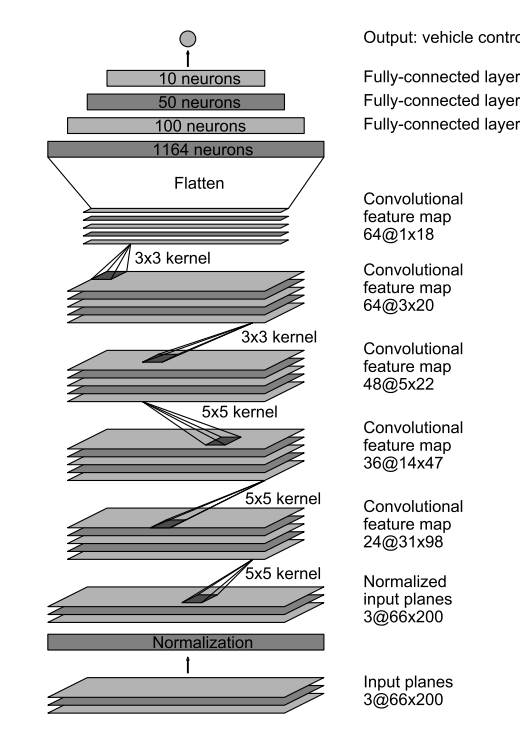
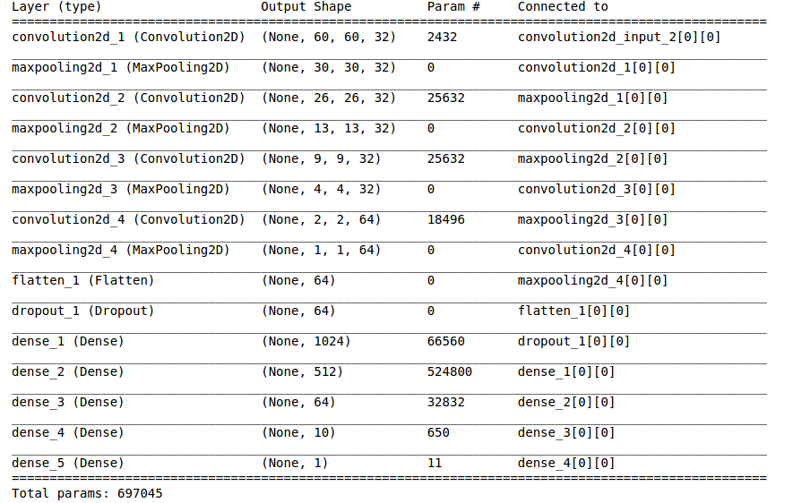

#**Behavorial Cloning Report** 

##Thomas Wieczorek

---

**Behavrioal Cloning Project**

The goals / steps of this project are the following:
* Use the simulator to collect data of good driving behavior
* Build, a convolution neural network in Keras that predicts steering angles from images
* Train and validate the model with a training and validation set
* Test that the model successfully drives around track one without leaving the road
* Summarize the results with a written report


[//]: # (Image References)

[image1]: ./examples/placeholder.png "Model Visualization"
[image2]: ./examples/placeholder.png "Grayscaling"
[image3]: ./examples/placeholder_small.png "Recovery Image"
[image4]: ./examples/placeholder_small.png "Recovery Image"
[image5]: ./examples/placeholder_small.png "Recovery Image"
[image6]: ./examples/placeholder_small.png "Normal Image"
[image7]: ./examples/placeholder_small.png "Flipped Image"

## Rubric Points
####Here I will consider the [rubric points](https://review.udacity.com/#!/rubrics/432/view) individually and describe how I addressed each point in my implementation.  

---
###Files Submitted & Code Quality

####1. Submission includes all required files and can be used to run the simulator in autonomous mode

My project includes the following files:
* `model.py` containing the script to create and train the model
* `drive.py` for driving the car in autonomous mode
* `model.h5` containing a trained convolution neural network 
* `writeup_report.md` or writeup_report.pdf summarizing the results

####2. Submssion includes functional code
Using the Udacity provided simulator and my `drive.py` file, the car can be driven autonomously around the track by executing 
```sh
python drive.py model.h5
```

####3. Submssion code is usable and readable

The model.py file contains the code for training and saving the convolution neural network. The file shows the pipeline I used for training and validating the model, and it contains comments to explain how the code works.

###Model Architecture and Training Strategy

####1. Appropriate training, validation and test data

* Training Data: I used the 66% of the Udacity training dataset, which contain center lane driving and recovering from the left and right side. 
* Validation Data: I used 33% of the Udacity training dataset and used them as validation set, to check the performances of my models. I used the sklearn function train_test_split (code line 284)
* Test Data: I recorded 2 laps of track #1 and 1 lap of track #2 for test data. In addition to that I tested on my simulator.

I used three cameras: center, left and right. For the left and right cameras, I corrected the steering angle with the parameter CAMERA_LEFT_RIGHT_OFFSET. Initially I set it to 0.2 and had good results with it.

####2. Data Normalisation and Augmentation

#####Normalisation:
I used three steps for Normalisation:

1) Cutting the Top and the Bottom of the image
2) Resize to smaller image size. Initially I resized to 100x100, but then I changed to 64x64 due to better results
3) Normalizing to a range of -0.5 to +0.5

	def resize_and_normalize(img):
	    #Cutting the Top and the Bottom of the image
	    img_cut = img[IMAGE_CUT_TOP_HEIGHT:160-IMAGE_CUT_DOWN_HEIGHT, :, :]

	    #Resize to smaller image size
	    img_resize = cv2.resize(img_cut, (IMAGE_RESIZE_WIDTH, IMAGE_RESIZE_HEIGHT), interpolation=cv2.INTER_AREA)
	            
	    #Normalizing to a range of -0.5 to +0.5
	    img_norm = (img_resize / 255. - .5).astype(np.float32)

	    return img_norm
_model.py, line 97-107  


_
#####Augmentation:
I used three steps for Augmentation:

1) Darken the image by adding shadows randomly
2) Vertically shift the image
3) Flipping the image horizontally (and inverting the steering angle)

	def augmentation(path, steering, validation):    

	    #Load
	    image = cv2.imread(path)
	    
	    #Augment
	    if not validation:
	        #Darken
	        if random.random() < CHANCES_DARKEN:
	            image = random_darken(image)

	        #Shift
	        if random.random() < CHANCES_SHIFT:
	            image = random_shift(image, 0, 0.2, 0, 1, 2)

	        #Flip
	        if random.random() < CHANCES_FLIP:
	            image = flip_axis(image,1)
	            steering = steering * -1    
	            
	    #Resize
	    image = resize_and_normalize(image)

	    
	    return image, steering
_model.py, line 114-138 

####3. An appropriate model arcthiecture has been employed

To reduce the memory usage I used the generator-function from Keras (line 255).

I used the NVIDIA-Architecture with the following layers:
* Normalisation Layer
* Convolutional Layer: 5x5 filter size and depth of 24. The strides (in keras called subsample) are 2x2. 
* Convolutional Layer: 5x5 filter size and depth of 36. The strides (in keras called subsample) are 2x2. 
* Convolutional Layer: 5x5 filter size and depth of 48. The strides (in keras called subsample) are 2x2. 
* Convolutional Layer: 3x3 filter size and depth of 64. No Strides
* Convolutional Layer: 3x3 filter size and depth of 64. No Strides
* Flatten Layer
* Fully Connected Layer with output_dim = 100
* Fully Connected Layer with output_dim = 50
* Fully Connected Layer with output_dim = 10
* Fully Connected Layer with output_dim = 10

All Convolutional and Fully connected Layer have 'elu' as Activation function.




The NVIDIA-Architecture was working pretty well, but I wanted to try my own Architecture.

**Second Architecture**:  




####4. Attempts to reduce overfitting in the model

The model contains dropout layers in order to reduce overfitting (model.py lines 210). 

My first step was to use a convolution neural network model similar to the [NVIDIA-Architecture](http://images.nvidia.com/content/tegra/automotive/images/2016/solutions/pdf/end-to-end-dl-using-px.pdf). I thought this model might be appropriate because the task is very similar and it is recommended by Udacity and other students.

In order to gauge how well the model was working, I split my image and steering angle data into a training and validation set. I found that my first model had a low mean squared error on the training set but a high mean squared error on the validation set. This implied that the model was overfitting. 

To combat the overfitting, I modified the model by adding Dropout. In addition to Dropout I implemented augmentation functions, to get a bigger training data size.


####4. Model parameter tuning

The model used an adam optimizer, so the learning rate was not tuned manually (model.py line 217).

Then I redesigned the architecture and used more Max-Pooling. With trial-and-error I tested a lot of parameters. As metric I used the squared error of the training set (by Udacity) and my 2 selfrecorded validation sets (track 1 and track 2). However I noticed, that the performance in the simulator is not fully correlated with the error size, so I tried my networks a lot with the real simulator.

The final step was to run the simulator to see how well the car was driving around track one, which was working without leaving the path. Sometimes an oscillation from left to right occured, but the car never left the path.

On track 2 however, there were some new situations (shadows, other textures) and the network performed worse, sometimes even leaving the path.

####Documentation of the trial-and-error parameters:

*------- NVIDEA NO DROPOUT ---------* 
Epoch 1/8  
22016/21990 [==============================] - 356s - loss: 0.0393    
Epoch 2/8  
22016/21990 [==============================] - 343s - loss: 0.0302   
Epoch 3/8  
22016/21990 [==============================] - 342s - loss: 0.0275     
Epoch 4/8  
22016/21990 [==============================] - 346s - loss: 0.0247     
Epoch 5/8  
22016/21990 [==============================] - 342s - loss: 0.0231     
Epoch 6/8  
22016/21990 [==============================] - 347s - loss: 0.0221     
Epoch 7/8  
22016/21990 [==============================] - 338s - loss: 0.0209     
Epoch 8/8  
22016/21990 [==============================] - 344s - loss: 0.0202     
Evaluation - Testset: 0.01836174918571487  
Evaluation - Validation-Test#1: 0.018810931127518415  
Evaluation - Validation-Test#2: 0.05028645205311477  

*------- NVIDEA WITH DROPOUT ---------*   

Epoch 1/8  
22016/21990 [==============================] - 373s - loss: 0.0391     
Epoch 2/8  
22016/21990 [==============================] - 339s - loss: 0.0333     
Epoch 3/8  
22016/21990 [==============================] - 336s - loss: 0.0285     
Epoch 4/8  
22016/21990 [==============================] - 347s - loss: 0.0279     
Epoch 5/8  
22016/21990 [==============================] - 335s - loss: 0.0265     
Epoch 6/8  
22016/21990 [==============================] - 339s - loss: 0.0254     
Epoch 7/8  
22016/21990 [==============================] - 341s - loss: 0.0237     
Epoch 8/8  
22016/21990 [==============================] - 336s - loss: 0.0233     
Evaluation - Testset: 0.017712658911477774  
Evaluation - Validation-Test#1: 0.01846477307844907  
Evaluation - Validation-Test#2: 0.05284461472183466  


*------- Second Architecture - Initital Parameters ---------*   


Epochs = 2

#####Image Parameters  
IMAGE_CUT_TOP_HEIGHT = 55
IMAGE_CUT_DOWN_HEIGHT = 25
IMAGE_RESIZE_WIDTH = 128
IMAGE_RESIZE_HEIGHT = 128

#####CameraParameters
CAMERA_LEFT_RIGHT_OFFSET = 0.2

#####Parameters: Chances for Augmentation  
CHANCES_SHIFT = 0.5
CHANCES_FLIP = 0.5
CHANCES_DARKEN = 0.5
BRIGHTNESS_RANGE = 0.3

#####Further Parameters
SPEED_MINIMUM = 20

**Results:**   
Epoch 1/2   
22016/21990 [==============================] - 480s - loss: 0.0291     
Epoch 2/2   
22016/21990 [==============================] - 470s - loss: 0.0202  
Evaluation - Testset: 0.016981107008177787  
Evaluation - Validation-Test1: 0.018147839815355837  
Evaluation - Validation-Test2: 0.04736811690963805  


**------- CAMERA_LEFT_RIGHT_OFFSET = 0.1 ---------**  
Epoch 1/2   
22016/21990 [==============================] - 462s - loss: 0.0184       
Epoch 2/2   
22016/21990 [==============================] - 463s - loss: 0.0175       
Evaluation - Testset: 0.013972967688459903   
Evaluation - Validation-Test1: 0.01593076391145587   
Evaluation - Validation-Test2: 0.05224249931052327   


**-------CAMERA_LEFT_RIGHT_OFFSET = 0.3 ---------**  
Evaluation - Testset: 0.04378993483260274   
Evaluation - Validation-Test1: 0.03643511841073632   
Evaluation - Validation-Test2: 0.06435602577403188   

**------- IMAGE_CUT_TOP_HEIGHT = 65 && IMAGE_CUT_DOWN_HEIGHT = 35  ---------**   

Epoch 1/2   
22016/21990 [==============================] - 477s - loss: 0.0287       
Epoch 2/2   
22016/21990 [==============================] - 449s - loss: 0.0197       
Evaluation - Testset: 0.017234275583177805   
Evaluation - Validation-Test1: 0.01590706582646817   
Evaluation - Validation-Test2: 0.0480130088981241   


**------- IMAGE_CUT_TOP_HEIGHT = 45 && IMAGE_CUT_DOWN_HEIGHT = 15 ---------**  
Epoch 1/2   
22016/21990 [==============================] - 459s - loss: 0.0287       
Epoch 2/2   
22016/21990 [==============================] - 450s - loss: 0.0207       
Evaluation - Testset: 0.01585360331228003   
Evaluation - Validation-Test1: 0.015312915144022554   
Evaluation - Validation-Test2: 0.047953514382243156   


**------- IMAGE_RESIZE_WIDTH = 64 && IMAGE_RESIZE_HEIGHT = 64 ---------**   
Epoch 1/2   
22016/21990 [==============================] - 452s - loss: 0.0281       
Epoch 2/2   
22016/21990 [==============================] - 453s - loss: 0.0207       
Evaluation - Testset: 0.016054037550929934   
Evaluation - Validation-Test1: 0.019261521752923727   
Evaluation - Validation-Test2: 0.0467897797934711   

**------- IMAGE_RESIZE_WIDTH = 32 && IMAGE_RESIZE_HEIGHT = 32 ---------** 

Epoch 1/2 
22016/21990 [==============================] - 457s - loss: 0.0276     
Epoch 2/2 
22016/21990 [==============================] - 459s - loss: 0.0196     
Evaluation - Testset: 0.016958175925537944  
Evaluation - Validation-Test1: 0.016497046628501266  
Evaluation - Validation-Test2: 0.04678394040092826  

**------- No Augmentation ---------** 

Epoch 1/2  
22016/21990 [==============================] - 465s - loss: 0.0300      
Epoch 2/2  
22016/21990 [==============================] - 469s - loss: 0.0216      
Evaluation - Testset: 0.015947682491969317  
Evaluation - Validation-Test1: 0.01666829123860225  
Evaluation - Validation-Test2: 0.06122697493992746  


####6 FINAL Parameter
I decided for the Second Architecture with these parameters:

Epochs = 8 

#####Image Parameters  
IMAGE_CUT_TOP_HEIGHT = 55  
IMAGE_CUT_DOWN_HEIGHT = 25  
IMAGE_RESIZE_WIDTH = 64  
IMAGE_RESIZE_HEIGHT = 64  

#####CameraParameters
CAMERA_LEFT_RIGHT_OFFSET = 0.2  

#####Parameters: Chances for Augmentation  
CHANCES_SHIFT = 0.5  
CHANCES_FLIP = 0.5  
CHANCES_DARKEN = 0.5  
BRIGHTNESS_RANGE = 0.3  

#####Further Parameters
SPEED_MINIMUM = 20  


#7 Results
Watch the whole Track #1 on YouTube:
[](http://www.youtube.com/watch?v=_J6eVQaCUfM "Whole Video of Training Track")

Driving on Training track, long curved road:


Recovering:


Second track, however it is not optimal...
