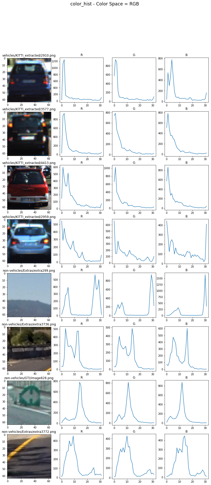
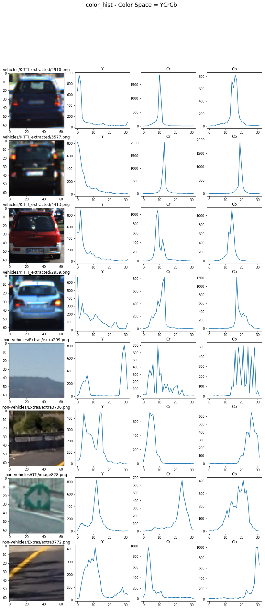
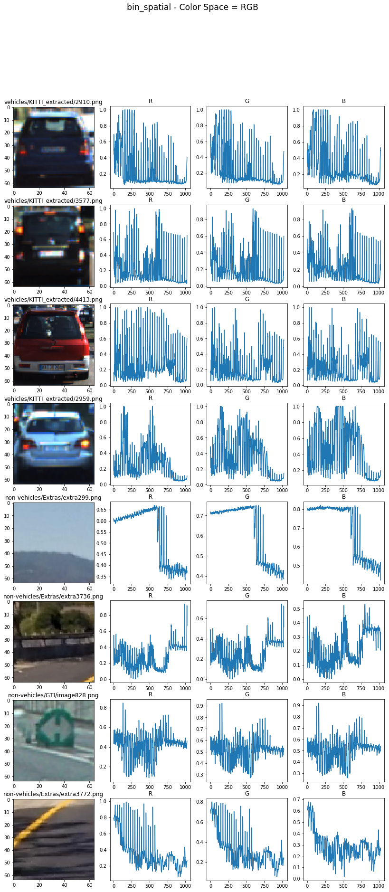
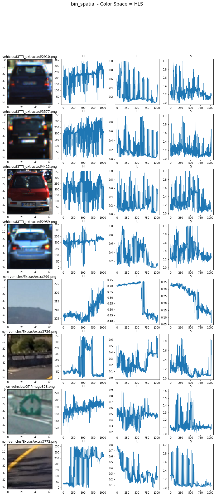
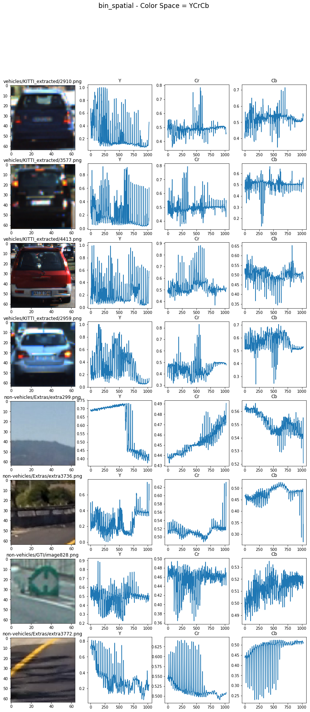
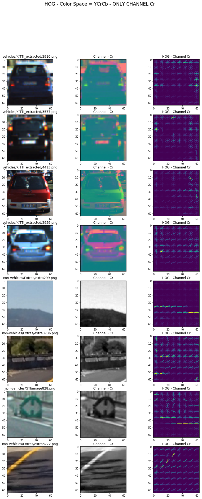
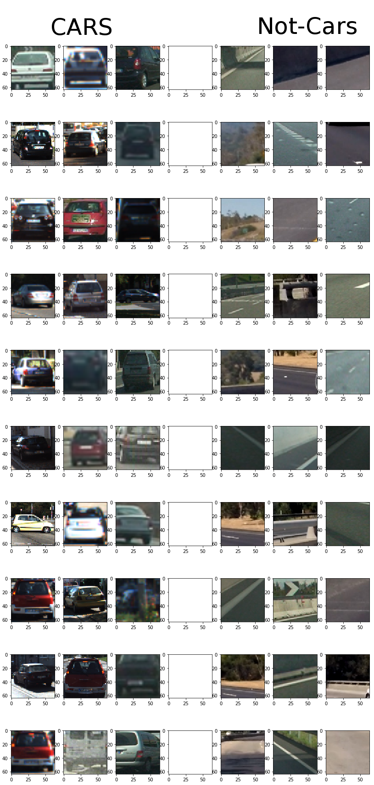

# Self Driving Car Nanodegree - Vehicle Detection 
### by Thomas Wieczorek - 06.03.2017
[](http://www.udacity.com/drive)


Project Overview
---

The goal of this project is to write a software pipeline to identify vehicles in a video from a front-facing camera on a car. 

The steps of this project are the following:

1. Generating Features
  1. Color Tranform Histogram
  2. Binned Color Feature
  3. Histogram of Oriented Gradients (HOG) feature 
  4. Summary on the used Features
2. Training a classifier to distinguish between Cars and Non-Cars
3. Implement a sliding-window technique and use the trained classifier to search for vehicles in images.

---
## 1. Generating Features

To train a classifier to detect vehicles, well defined input-features are required. One very easy way is to simply use the pixel values of a picture. However, especially with traditional Machine Learning classifier like Support-Vector Machines, the results are suboptimal.

A better approach to achieve good features is by generating them with different algorithms and combining all features.

###  i. Color Transform Histogram

The code for Color Transform Histogram can be found in `vehicle_detection.ipynb`. 

Exact Template matching (every pixel is identical) is not a promising approach, because every car looks different in a frame. However, we can use some patterns that are indicate cars.

One pattern is brightly colored car paint. The colors between cars may vary, but often the colors are mostly vibrant compared to the street or bushes.

The function `color_hist` takes an image and a bin size and returns three concatenated histograms for every color chanel:
```python
def color_hist(img, nbins=32):
    # Compute the histogram of the color channels separately
    channel1_hist = np.histogram(img[:,:,0], bins=nbins)
    channel2_hist = np.histogram(img[:,:,1], bins=nbins)
    channel3_hist = np.histogram(img[:,:,2], bins=nbins)
    # Concatenate the histograms into a single feature vector
    hist_features = np.concatenate((channel1_hist[0], channel2_hist[0], channel3_hist[0]))
    # Return the individual histograms, bin_centers and feature vector
    return hist_features
```

The function `plot_colorhistogram` takes a color space as input and plots the resulting histograms (however it plots them as charts, because patterns are easier visible) for every color channel. 

```python
def plot_colorhistogram(color=None, title_a='R', title_b='G', title_c='B', function='color_hist'):
    f, ax = plt.subplots(2*EXAMPLE_SIZE, 4, figsize=(14,30))
    f.suptitle(function + ' - Color Space = ' + title_a + title_b + title_c , fontsize='xx-large')

    #cars_indicies = random.sample(range(0, len(cars)), EXAMPLE_SIZE)
    for i, index in enumerate(cars_indicies):
        example_car = mpimg.imread(cars[index])
        if color is not None:
            example_car_color = cv2.cvtColor(example_car, color)
        else:
            example_car_color = example_car
        
        if function == 'color_hist':
            c_hist = color_hist(example_car_color,nbins=32)
        else:
            c_hist = bin_spatial(example_car_color)
            
        color_size = (int)(c_hist.shape[0]/3)
        a = c_hist[0:color_size]
        b = c_hist[color_size:2*color_size]
        c = c_hist[2*color_size:3*color_size]
        ax[i][0].imshow(example_car)
        ax[i][0].set_title(cars[index][16:])
        
        ax[i][1].plot(a)
        ax[i][2].plot(b)
        ax[i][3].plot(c)
        
        ax[i][1].set_title(title_a)
        ax[i][2].set_title(title_b)
        ax[i][3].set_title(title_c)
```

The result for *Color Transform Histogram* for four car images and four non-car images for *RGB-colorspace*:



Some patterns are visible for the human eye. However the color space *RGB* has some deficits, because it will always be different for every vehicle color. Other color spaces like *HLS* or *YCrCb* could be better.
https://en.wikipedia.org/wiki/RGB_color_model
https://en.wikipedia.org/wiki/HSL_and_HSV
https://en.wikipedia.org/wiki/YCbCr

The result for *Color Transform Histogram* for four car images and four non-car images for *HLS-colorspace*:


The result for *Color Transform Histogram* for four car images and four non-car images for *YCrCb-colorspace*:



The patterns are way more distinguishable with *HLS* or *YCrCb*, than with *RGB*. 

*The final decision was made on the YCrCb-Colorspace.*

###  ii. Spatial Binned Color Feature

The code for Color Transform Histogram can be found in `vehicle_detection.ipynb`. 

Instead of using a histogram, another approach is to Spatial Bin the color Features. 

```python
def bin_spatial(img, size=(32, 32)):
    color1 = cv2.resize(img[:,:,0], size).ravel()
    color2 = cv2.resize(img[:,:,1], size).ravel()
    color3 = cv2.resize(img[:,:,2], size).ravel()
    return np.hstack((color1, color2, color3))
```

Using the function `plot_colorhistogram` again, the results are also very useful. 

The result for *Spatial Binned Color Feature* for four car images and four non-car images for *RGB-colorspace*:



The result for *Spatial Binned Color Feature* for four car images and four non-car images for *HLS-colorspace*:



The result for *Spatial Binned Color Feature* for four car images and four non-car images for *YCrCb-colorspace*:



*The final decision was made again on the YCrCb-Colorspace.*

###  iii. Histogram of Oriented Gradients (HOG) feature 

*"The histogram of oriented gradients (HOG) is a feature descriptor used in computer vision and image processing for the purpose of object detection. The technique counts occurrences of gradient orientation in localized portions of an image."* Source: [Wikipedia - Histogram_of_oriented_gradients](https://en.wikipedia.org/wiki/Histogram_of_oriented_gradients)

The code for HOG can be found in `vehicle_detection.ipynb`. The function `get_hog_features` returns the Histogram of Oriented Gradients. 

```python
def get_hog_features(img, orient, pix_per_cell, cell_per_block, 
                        vis=False, feature_vec=False):
    # Call with two outputs if vis==True
    if vis == True:
        features, hog_image = hog(img, orientations=orient, 
                                  pixels_per_cell=(pix_per_cell, pix_per_cell),
                                  cells_per_block=(cell_per_block, cell_per_block), 
                                  transform_sqrt=False, 
                                  visualise=vis, feature_vector=feature_vec)
        return features, hog_image
    # Otherwise call with one output
    else:      
        features = hog(img, orientations=orient, 
                       pixels_per_cell=(pix_per_cell, pix_per_cell),
                       cells_per_block=(cell_per_block, cell_per_block), 
                       transform_sqrt=False, 
                       visualise=vis, feature_vector=feature_vec)
        return features
```
The parameters were set on:

* ORIENT = 6
* PIX_PER_CELLS = 8
* CELL_PER_BLOCK = 2
* _(The reason for this values are explained in chapter 2.)_

The result for *Histogram of Oriented Gradients (HOG)* for four car images and four non-car images for each of the *YCrCb-colorspace*:





###  iv. Summary on the used Features

In the function `find_cars`, all features from i, ii and iii are merged into one long feature vector. The relevant code parts for the feature vector are:

```python
def find_cars(img, ystart, ystop, scale, svc, X_scaler, orient, pix_per_cell, cell_per_block, spatial_size, hist_bins):

#[...]

ctrans_tosearch = convert_color(img_tosearch, conv='RGB2YCrCb')
ch1 = ctrans_tosearch[:,:,0]
ch2 = ctrans_tosearch[:,:,1]
ch3 = ctrans_tosearch[:,:,2]

#[...]

# Compute individual channel HOG features for the entire image
hog1 = get_hog_features(ch1, orient, pix_per_cell, cell_per_block, feature_vec=False)
hog2 = get_hog_features(ch2, orient, pix_per_cell, cell_per_block, feature_vec=False)
hog3 = get_hog_features(ch3, orient, pix_per_cell, cell_per_block, feature_vec=False)

for xb in range(nxsteps):
    for yb in range(nysteps):
        ypos = yb*cells_per_step
        xpos = xb*cells_per_step
        # Extract HOG for this patch
        hog_feat1 = hog1[ypos:ypos+nblocks_per_window, xpos:xpos+nblocks_per_window].ravel() 
        hog_feat2 = hog2[ypos:ypos+nblocks_per_window, xpos:xpos+nblocks_per_window].ravel() 
        hog_feat3 = hog3[ypos:ypos+nblocks_per_window, xpos:xpos+nblocks_per_window].ravel() 
        hog_features = np.hstack((hog_feat1, hog_feat2, hog_feat3))

        xleft = xpos*pix_per_cell
        ytop = ypos*pix_per_cell

        # Extract the image patch
        subimg = cv2.resize(ctrans_tosearch[ytop:ytop+window, xleft:xleft+window], (64,64))

        # Get color features
        spatial_features = bin_spatial(subimg, size=spatial_size)
        hist_features = color_hist(subimg, nbins=hist_bins)

        test_features = X_scaler.transform(np.hstack((spatial_features, hist_features, hog_features)).reshape(1, -1))    

```

---
## 2. Training a classifier to distinguish between Cars and Non-Cars

Having the a long and useful feature vector is the foundation for the next step: classification. Using [Support Vector Machines](https://en.wikipedia.org/wiki/Support_vector_machine) the input vector is used to distinguish cars from not cars.

To train the classifier a given training set was used, consisting of [8792 Car-Images](https://s3.amazonaws.com/udacity-sdc/Vehicle_Tracking/vehicles.zip) and [8968 Non-Car-Images](https://s3.amazonaws.com/udacity-sdc/Vehicle_Tracking/non-vehicles.zip). All images are .png and have a size of 64x64px. Here are some examples of the training data:




---
## 3. Implement a sliding-window technique and use the trained classifier to search for vehicles in images.
